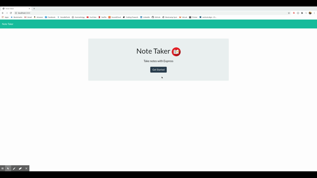
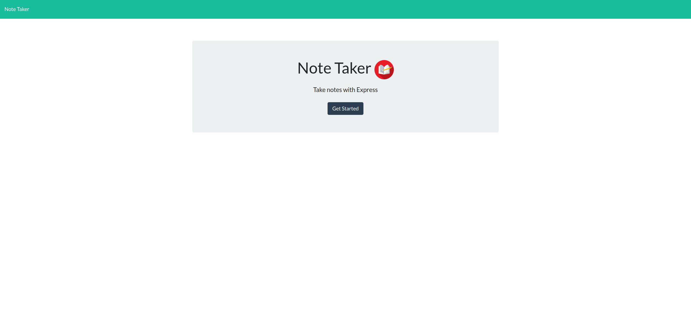
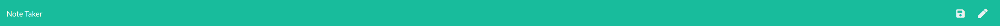
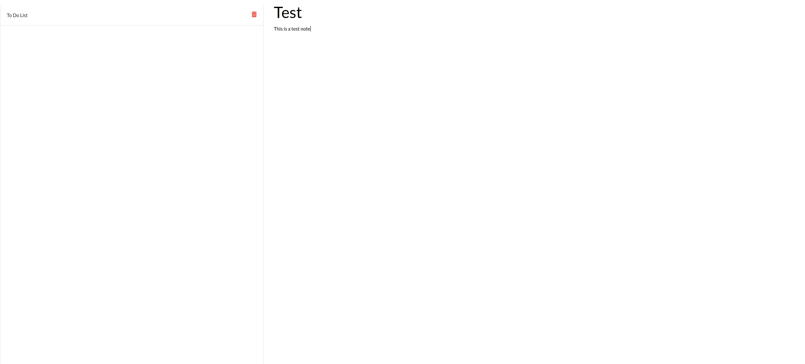

# Express Note Taker
 

## Description
This project allows a user to take and save notes with a title and text content. The initial screen contains a title and a button that will take the user to the notes page. The user can then create/save notes, view saved notes, and delete notes from that page. All saved notes can be accessed from any browser or computer and through any window closure or computer reset. This is accomplished by using server side code and npm packages to write all the notes to a .json file that is affiliated with the webpage's server.

### Demo

## Table Of Contents
- [Access and Installation](#Access-and-Installation)
- [Usage](#Usage)
- [Features](#Features)
- [License](#License)
- [Contribution Guidelines](#Contribution-Guidelines)
- [Test Instructions](#Test-Instructions)
- [Questions](#Questions)

## Access and Installation

No external software or servers are necessary to install this project except for a text editor and a working browser. You can git clone this repository to your local computer and open the code files using a text editor. Once the correct npm packages are installed, the program can be run from the command line as long as you are in the same directory as the code files. The repository includes the package.json file needed to install the correct npm pacakges/dependencies. 

This project can be accessed either via the GitHub Repository.

- [GitHub Repository](https://github.com/sophia2798/note_taker)

To open and edit code files, you will need a text editor. The one used to create this page was Visual Studio Code (https://code.visualstudio.com/).

To install this repository, you can git clone the repository using the green "Code" button. You can copy and paste either the HTML or SSH URL.

## Usage
This project can be used to create and store notes so they can be viewed later and remembered. The ability to view the saved notes across any browser or computer enhances accessibility for the user as they will be able to reference their notes from anywhere with internet access. 

This project can also be used as a template to learn more about server side coding, express.js, routing, and streamlined directory organization. 

## Features
This project includes...

- A main page that includes a title and a button that will take the user to the notes page.

- A navbar with a button to save a note, a button to write a new note, and a working "Note Taker" link that will take the user back to the main page.

- Containers to input the note's title and text content. Additionally, there is an aside that stores the saved notes to be viewed when clicked or deleted when the garbage icon is clicked.

## License
MIT
A short and simple permissive license with conditions only requiring preservation of copyright and license notices. Licensed works, modifications, and larger works may be distributed under different terms and without source code.

## Contribution Guidelines
Currently, this repository is not set up for contributions. A development branch, to which all merges can be made while protecting the master branch, must be made first. Therefore, please contact the owner(s) of this repository to start and manage such a branch.

Please ensure that PRIOR to any new contributions, you discuss your desired/planned changes via email with the owner(s) of the repository. Contact information can be found in the [Questions](#Questions) section. Changes should be reflected in an updated README as well. To ensure a high quality of code and minimal conflicts, pull requests can only be merged after being approved by another developer. 

To ensure a welcoming working environment, any contributor to this project must help maintain a harassment-free and safe environment. This includes:
    - Using inclusive language
    - Being respectful of various backgrounds and opinions
    - Accepting constructive criticism without aggression or anger
    - Being aware of what benefits the whole community
    - Showing kindness and empathy to one another

## Test Instructions
As the package.json file exists in this repository, only the following line is needed to install the necessary pacakges

    npm install

To run the program, input the following code into the command line

    npm start

## Questions
If you have any questions, please feel free to reach out via email at sdf. Any further information can be found on my [GitHub Profile](https://github.com/sophia2798) or my [LinkedIn Profile](https://linkedin.com/in/sophia2798).